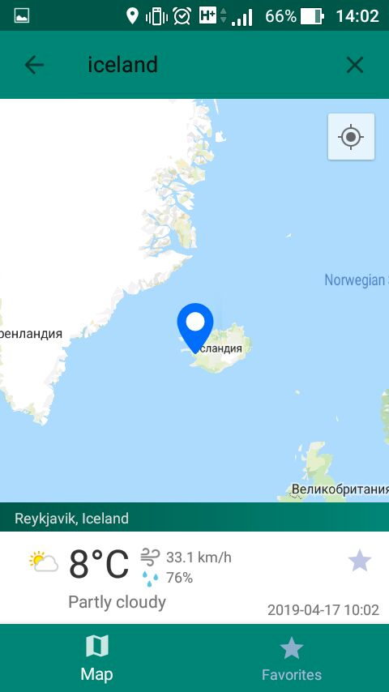
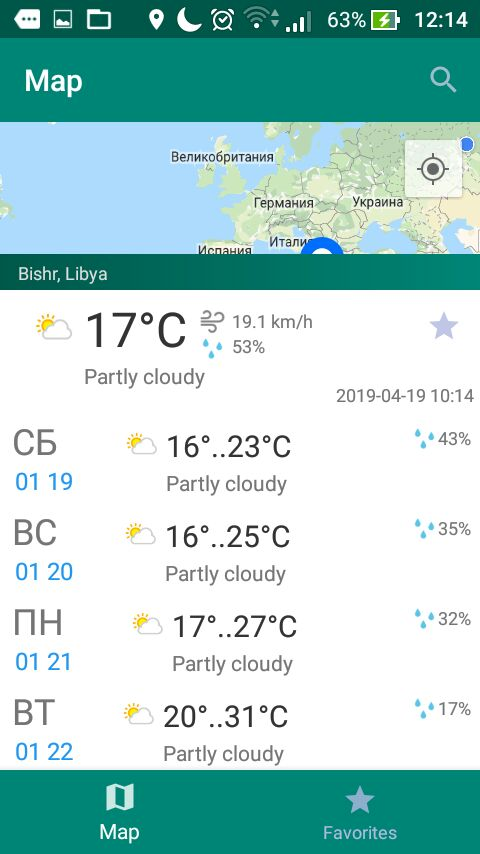

# Recipe Offer Project
Учебный проект (устаревший, но все же), представляет собой Android приложение, которое показывает погоду и прогноз погоды на 4 дня для конкретного места. Место задается либо положением на карте (Google Maps), либо вводом наименования страны, города. Также есть функция добавления местоположения в Закладки. В этой вкладке можно вернуться к месту и просмотреть его актуальные данные погоды. 

## API
Используется API Apixu, предоставляющая доступ к погодным данным во всем мире. Они доступны по координатам, наименованию места. Авторизация запросов проходит по выданному API ключу. (Сейчас данная API уже не работает)

## Стек технологий
* Java
* Fragments, FragmentManager
* SQLite
* Retrofit
* Google Maps API, Map View

## Архитектура
В качестве архитектуры использовалась архитектура MVC. Приложение разделено на 3 подуровня.
* Представление - layouts, виджеты
* Контроллеры - взаимодействует с View и Model, управляют потоками данных (Activity, Фрагменты, Адаптеры для RecyclerView)
* Модель - данные и бизнес логика

## Фото интерфейса

  
  

